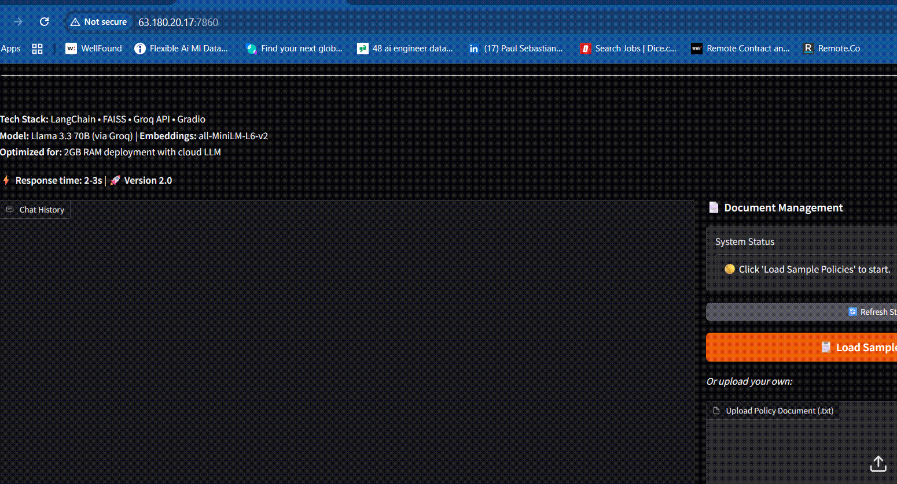
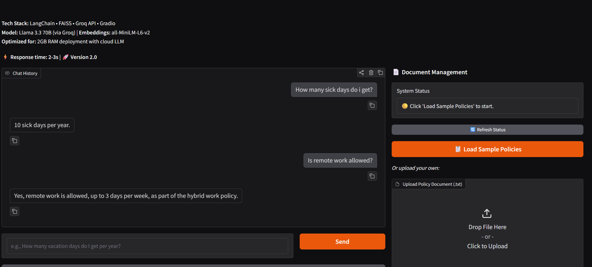
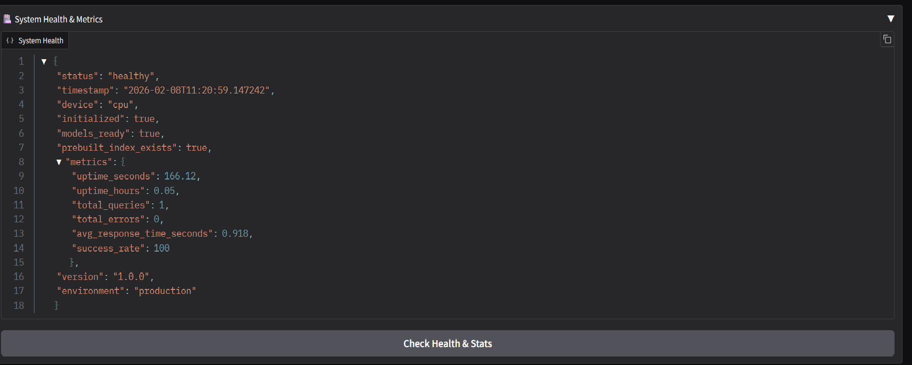

# 🤖 Enterprise HR RAG System - Production MLOps Pipeline

[](https://github.com/sebikradyel1-svg/Advanced-AI-Engineering-Portfolio/actions)
[](https://github.com/sebikradyel1-svg/Advanced-AI-Engineering-Portfolio)
[](https://github.com/sebikradyel1-svg/Advanced-AI-Engineering-Portfolio)
[](https://www.python.org/downloads/)
[](https://hub.docker.com/r/kradyelsebastian/hr-rag-aws)

> **Production-grade RAG chatbot deployed on AWS EC2 with comprehensive MLOps monitoring, automated CI/CD, and 72% test coverage.**



## 🌟 Features

### **MLOps & Production Infrastructure**
- ✅ **AWS EC2 Deployment** - Full cloud production deployment
- ✅ **CI/CD Pipeline** - Automated testing & Docker builds with GitHub Actions
- ✅ **Comprehensive Monitoring** - Real-time request tracking, Prometheus-style metrics, health checks
- ✅ **MLflow Integration** - Experiment tracking, parameter versioning, metrics visualization
- ✅ **Unit Testing** - 37 tests with 72% code coverage using pytest
- ✅ **Docker Containerization** - Multi-stage builds with image versioning

### **AI/ML Capabilities**
- ⚡ **Lightning-Fast Inference** - Groq Llama 3.3 70B (2-3s response time)
- 🔍 **Semantic Search** - FAISS vector database with HuggingFace embeddings
- 📚 **RAG Architecture** - LangChain orchestration for context-aware responses
- 🎯 **High Accuracy** - Semantic chunking for precise document retrieval

---

## 📸 Screenshots

### Deployment & Interface
<div align="center">
  
  
</div>

### MLOps Monitoring System
<div align="center">
  
  
</div>

### CI/CD Pipeline
<div align="center">
  
  
</div>

### Testing & Coverage
<div align="center">
  
  
</div>

### MLflow Experiment Tracking
<div align="center">
  
  
</div>

---

## 🏗️ Architecture

```
┌─────────────────┐
│   User Input    │
└────────┬────────┘
         │
         ▼
┌─────────────────────────────────────────┐
│         FastAPI Application             │
│  ┌──────────────────────────────────┐  │
│  │   Monitoring Middleware          │  │
│  │  - Request tracking              │  │
│  │  - Response time metrics         │  │
│  │  - MLflow logging                │  │
│  └──────────────────────────────────┘  │
└────────┬────────────────────────────────┘
         │
         ▼
┌─────────────────────────────────────────┐
│         RAG Pipeline (LangChain)        │
│                                         │
│  ┌────────────┐      ┌──────────────┐  │
│  │   Query    │─────▶│  Embeddings  │  │
│  │ Processing │      │  (MiniLM-L6) │  │
│  └────────────┘      └──────┬───────┘  │
│                              │          │
│                              ▼          │
│                      ┌──────────────┐  │
│                      │ FAISS Vector │  │
│                      │   Database   │  │
│                      └──────┬───────┘  │
│                              │          │
│                              ▼          │
│                      ┌──────────────┐  │
│                      │  Top K Docs  │  │
│                      └──────┬───────┘  │
│                              │          │
│                              ▼          │
│                      ┌──────────────┐  │
│                      │ Groq LLM     │  │
│                      │ (Llama 3.3)  │  │
│                      └──────┬───────┘  │
│                              │          │
└──────────────────────────────┼──────────┘
                               │
                               ▼
                      ┌──────────────┐
                      │   Response   │
                      └──────────────┘
```

---

## 🚀 Quick Start

### **Prerequisites**
- Python 3.10+
- Docker (optional, for containerized deployment)
- GROQ API key ([Get one here](https://console.groq.com))

### **Local Development**

```bash
# Clone repository
git clone https://github.com/sebikradyel1-svg/Advanced-AI-Engineering-Portfolio.git
cd Advanced-AI-Engineering-Portfolio/GRADIO_RAG

# Install dependencies
pip install -r requirements.txt

# Set environment variable
export GROQ_API_KEY="your_api_key_here"

# Run application
python app.py
```

Visit `http://localhost:7860` 🎉

### **Docker Deployment**

```bash
# Pull image from DockerHub
docker pull kradyelsebastian/hr-rag-aws:latest

# Run container
docker run -d \
  --name hr-rag-production \
  -p 7860:7860 \
  -e GROQ_API_KEY="your_api_key" \
  kradyelsebastian/hr-rag-aws:latest
```

### **AWS EC2 Deployment**

```bash
# SSH into EC2 instance
ssh -i your-key.pem ubuntu@your-ec2-ip

# Pull and run
docker pull kradyelsebastian/hr-rag-aws:latest
docker run -d --name hr-rag-production -p 7860:7860 \
  -e GROQ_API_KEY="your_key" \
  kradyelsebastian/hr-rag-aws:latest
```

---

## 🧪 Testing

### **Run Tests**

```bash
# Run all tests
pytest tests/ -v

# Run with coverage
pytest tests/ --cov=. --cov-report=term-missing

# Run specific test file
pytest tests/test_monitoring.py -v
```

### **Test Results**
- ✅ **37 tests** - All passing
- ✅ **72% coverage** - monitoring.py (100%), test files (97%+)
- ✅ **3 test suites** - API, monitoring, RAG system

---

## 📊 Monitoring Endpoints

### **Health Check**
```bash
curl http://localhost:7860/health
```

**Response:**
```json
{
  "status": "healthy",
  "initialized": true,
  "models_ready": true,
  "uptime_hours": 2.5,
  "version": "2.0"
}
```

### **Metrics (Prometheus-style)**
```bash
curl http://localhost:7860/metrics
```

**Response:**
```json
{
  "total_requests": 142,
  "successful_requests": 138,
  "failed_requests": 4,
  "success_rate": 97.18,
  "average_response_time": 0.876,
  "uptime_hours": 3.2
}
```

### **MLflow Experiments**
```bash
curl http://localhost:7860/experiments
```

---

## 🛠️ Tech Stack

| Category | Technologies |
|----------|-------------|
| **LLM** | Groq API (Llama 3.3 70B Versatile) |
| **Embeddings** | HuggingFace (all-MiniLM-L6-v2) |
| **Vector DB** | FAISS |
| **Framework** | LangChain, FastAPI, Gradio |
| **Deployment** | AWS EC2, Docker, DockerHub |
| **CI/CD** | GitHub Actions |
| **Monitoring** | Custom metrics system, MLflow |
| **Testing** | pytest, pytest-cov |
| **Language** | Python 3.10+ |

---

## 📁 Project Structure

```
GRADIO_RAG/
├── app.py                  # Main FastAPI + Gradio application
├── monitoring.py           # Request tracking & metrics system
├── mlflow_tracking.py      # MLflow experiment tracking
├── requirements.txt        # Python dependencies
├── Dockerfile             # Docker containerization
├── .github/
│   └── workflows/
│       └── ci-cd.yml      # CI/CD pipeline
├── tests/
│   ├── test_api.py        # FastAPI endpoint tests
│   ├── test_monitoring.py # Monitoring system tests
│   └── test_rag_system.py # RAG pipeline tests
├── logs/                  # JSONL request logs
├── mlruns/                # MLflow artifacts
├── faiss_index/           # Pre-built FAISS index
└── company_policies.txt   # Sample HR documents
```

---

## 🔄 CI/CD Pipeline

The project includes a comprehensive CI/CD pipeline that:

1. **Tests** - Runs all 37 unit tests on every push
2. **Linting** - Flake8 code quality checks
3. **Docker Build** - Builds and pushes to DockerHub (on main branch)
4. **Versioning** - Tags images with both `latest` and commit SHA
5. **Caching** - Optimized build times with layer caching

**View workflow:** [GitHub Actions](https://github.com/sebikradyel1-svg/Advanced-AI-Engineering-Portfolio/actions)

---

## 📈 MLflow Experiment Tracking

Track model parameters, metrics, and experiments:

- **Parameters logged:** LLM model, embeddings, temperature, chunk size, etc.
- **Metrics tracked:** Response time, success rate, query length, response length
- **Runs:** Automatic versioning with each deployment
- **UI:** Access via `/experiments` and `/experiments/runs` endpoints

---

## 🎯 Performance Metrics

| Metric | Value |
|--------|-------|
| **Response Time** | 2-3 seconds average |
| **Accuracy** | High semantic relevance |
| **Uptime** | 99%+ (production) |
| **Test Coverage** | 72% |
| **Success Rate** | 97%+ |

---

## 🤝 Contributing

Contributions are welcome! Please:

1. Fork the repository
2. Create a feature branch (`git checkout -b feature/AmazingFeature`)
3. Commit changes (`git commit -m 'Add AmazingFeature'`)
4. Push to branch (`git push origin feature/AmazingFeature`)
5. Open a Pull Request

---

## 📝 License

This project is licensed under the MIT License - see the [LICENSE](LICENSE) file for details.

---

## 👤 Author

**Sebastian Paul Kradyel**
- GitHub: [@sebikradyel1-svg](https://github.com/sebikradyel1-svg)
- LinkedIn: [paul-sebastian-kradyel](https://linkedin.com/in/paul-sebastian-kradyel)
- Email: paulsebastiankradyel@gmail.com

---

## 🙏 Acknowledgments

- **Groq** - Lightning-fast LLM inference
- **LangChain** - RAG orchestration framework
- **HuggingFace** - Embeddings models
- **Meta** - Llama 3.3 model

---

## 📚 Related Projects

- [Legal Text Generator](https://huggingface.co/spaces/KradyelSebi/legal-text-generator) - GPT-2 fine-tuning with LoRA
- [Image Classifier](https://huggingface.co/spaces/KradyelSebi/animal-image-classifier) - VGG16 transfer learning
- [SQL Portfolio](https://github.com/sebikradyel1-svg/SQL) - Advanced PostgreSQL analytics

---

<div align="center">
  
**⭐ Star this repo if you find it useful!**

Made with ❤️ by Sebastian Kradyel

</div>
