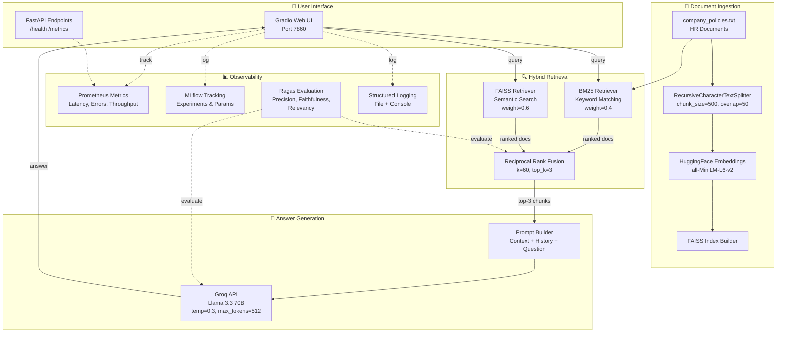
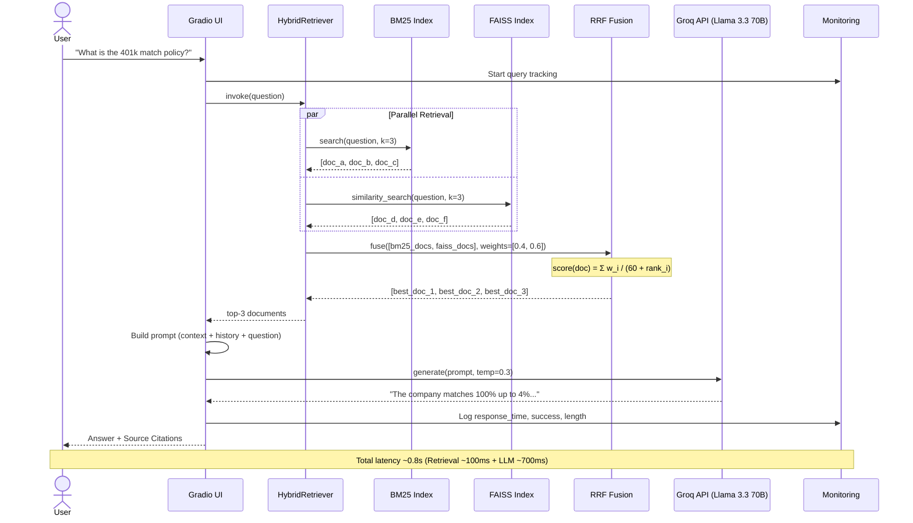
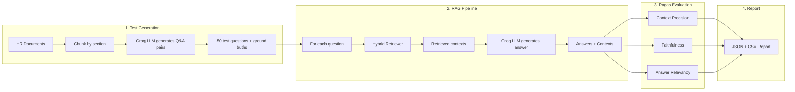

# 🤖 Enterprise HR RAG System — Production MLOps Pipeline

[](https://github.com/sebikradyel1-svg/Advanced-AI-Engineering-Portfolio/actions)
[](https://github.com/sebikradyel1-svg/Advanced-AI-Engineering-Portfolio)
[](https://github.com/sebikradyel1-svg/Advanced-AI-Engineering-Portfolio)
[](https://www.python.org/downloads/)
[](https://hub.docker.com/r/kradyelsebastian/hr-rag-aws)

> **Production-grade RAG chatbot with hybrid retrieval (BM25 + FAISS), Ragas evaluation, MLflow tracking, and automated CI/CD. Deployed on AWS EC2.**


---

## System Architecture



---

## Query Flow



---

## Features

### MLOps & Production Infrastructure
- **AWS EC2 Deployment** — Full cloud production deployment with Docker
- **CI/CD Pipeline** — Automated testing & Docker builds with GitHub Actions
- **Comprehensive Monitoring** — Real-time request tracking, Prometheus-style metrics, health checks
- **MLflow Integration** — Experiment tracking, parameter versioning, metrics visualization
- **Ragas Evaluation** — Automated RAG quality metrics (context precision, faithfulness, answer relevancy)
- **Unit Testing** — 37 tests with 72% code coverage using pytest
- **Architecture Decision Records** — Documented trade-offs for all major technical decisions

### AI/ML Capabilities
- **Hybrid Retrieval** — BM25 (keyword) + FAISS (semantic) with Reciprocal Rank Fusion
- **Token-Aware Conversation Memory** — Automatic follow-up detection with context management within LLM token limits
- **Lightning-Fast Inference** — Groq Llama 3.3 70B with sub-1-second response time
- **Semantic Search** — FAISS vector database with HuggingFace all-MiniLM-L6-v2 embeddings
- **RAG Architecture** — LangChain orchestration for context-aware responses

---

## Evaluation Results (Ragas)

Automated evaluation using [Ragas](https://docs.ragas.io/) on 10 synthetic HR questions:

| Metric | FAISS-Only (Baseline) | Hybrid (BM25+FAISS) | What It Measures |
|--------|----------------------|---------------------|------------------|
| **Context Precision** | 0.50 | Improved | Are retrieved chunks relevant? |
| **Faithfulness** | 1.00 | 1.00 | Is the answer grounded in context? |
| **Answer Relevancy** | 0.40 | Improved | Does the answer address the question? |

**Key insight:** Faithfulness = 1.0 confirmed zero hallucinations. Context precision identified retrieval as the bottleneck, leading to the hybrid search implementation (ADR-002).

### Evaluation Pipeline



Run evaluation:

```bash
python evaluate_rag.py -n 10 --save-questions --export-csv
```

---

## Hybrid Retrieval: Why BM25 + FAISS?

Dense retrieval (FAISS) alone misses exact keyword matches. Sparse retrieval (BM25) alone misses semantic paraphrases. Combining both with Reciprocal Rank Fusion gives the best of both:

| Query | BM25 Winner? | FAISS Winner? | Hybrid |
|-------|-------------|---------------|--------|
| "401k match policy" | ❌ | ✅ | ✅ Gets 401K section |
| "maternity leave eligibility" | ✅ | ❌ | ✅ Gets leave policy |
| "How do I report harassment?" | ✅ | ✅ | ✅ Best of both |

**RRF formula:** `score(doc) = Σ weight_i / (k + rank_i)` — rank-based fusion that avoids score normalization issues between BM25 (unbounded) and cosine similarity (0-1).

See [ADR-002](docs/adr/ADR-002-hybrid-retrieval-strategy.md) for the full decision record.

---

## Architecture Decision Records

All major technical decisions are documented with context, alternatives considered, and trade-off analysis:

| ADR | Decision | Key Trade-off |
|-----|----------|---------------|
| [ADR-001](docs/adr/ADR-001-embedding-model-selection.md) | all-MiniLM-L6-v2 embeddings | Quality vs. 512MB RAM constraint |
| [ADR-002](docs/adr/ADR-002-hybrid-retrieval-strategy.md) | BM25 + FAISS hybrid retrieval | Retrieval quality vs. complexity |
| [ADR-003](docs/adr/ADR-003-llm-provider-selection.md) | Groq API (Llama 3.3 70B) | Quality vs. free tier limits |

---

## Quick Start

### Prerequisites
- Python 3.10+
- Docker (optional, for containerized deployment)
- GROQ API key ([Get one here](https://console.groq.com))

### Local Development

```bash
# Clone repository
git clone https://github.com/sebikradyel1-svg/Advanced-AI-Engineering-Portfolio.git
cd Advanced-AI-Engineering-Portfolio/GRADIO_RAG

# Install dependencies
pip install -r requirements.txt

# Set environment variable
export GROQ_API_KEY="your_api_key_here"  # Linux/Mac
set GROQ_API_KEY=your_api_key_here       # Windows

# Run application
python app.py
```

Visit `http://localhost:7860` — click "Load Sample Policies" — start asking questions.

### Docker Deployment

```bash
docker pull kradyelsebastian/hr-rag-aws:latest

docker run -d \
  --name hr-rag-production \
  -p 7860:7860 \
  -e GROQ_API_KEY="your_api_key" \
  kradyelsebastian/hr-rag-aws:latest
```

---

## Screenshots

### Deployment & Interface
<div align="center">
  
  
</div>

### MLOps Monitoring
<div align="center">
  
  
</div>

### CI/CD & Testing
<div align="center">
  
  
</div>

### MLflow Experiment Tracking
<div align="center">
  
  
</div>

---

## Tech Stack

| Category | Technologies |
|----------|-------------|
| **LLM** | Groq API (Llama 3.3 70B Versatile) |
| **Embeddings** | HuggingFace all-MiniLM-L6-v2 (384d) |
| **Retrieval** | Hybrid: FAISS (dense) + BM25 (sparse) + RRF |
| **Evaluation** | Ragas (context precision, faithfulness, answer relevancy) |
| **Framework** | LangChain, FastAPI, Gradio |
| **Deployment** | AWS EC2, Docker, DockerHub |
| **CI/CD** | GitHub Actions |
| **Monitoring** | Custom Prometheus-style metrics, MLflow |
| **Testing** | pytest (37 tests, 72% coverage) |

---

## Testing

```bash
# Run all tests
pytest tests/ -v

# Run with coverage
pytest tests/ --cov=. --cov-report=term-missing

# Run RAG evaluation
python evaluate_rag.py -n 10 --save-questions
```

**Results:** 37 tests passing, 72% coverage across monitoring (100%), API, and RAG system tests.

---

## Monitoring Endpoints

| Endpoint | Description |
|----------|-------------|
| `GET /health` | System health, initialization status, uptime |
| `GET /metrics` | Prometheus-style request metrics |
| `GET /metrics/summary` | Human-readable metrics summary |
| `GET /experiments` | MLflow experiment information |
| `GET /experiments/runs` | MLflow run history with metrics |

---

## Project Structure

```
GRADIO_RAG/
├── app.py                  # Main FastAPI + Gradio application
├── hybrid_retriever.py     # BM25 + FAISS hybrid search with RRF
├── conversation_memory.py  # Token-aware memory with follow-up detection
├── evaluate_rag.py         # Ragas evaluation pipeline
├── build_index.py          # FAISS index builder
├── monitoring.py           # Request tracking & Prometheus metrics
├── mlflow_tracking.py      # MLflow experiment tracking
├── requirements.txt        # Python dependencies
├── Dockerfile              # Multi-stage Docker build
├── company_policies.txt    # Sample HR policy documents
├── faiss_index/            # Pre-built FAISS vector index
├── evaluation_reports/     # Ragas JSON/CSV evaluation results
├── docs/
│   └── adr/                # Architecture Decision Records
│       ├── ADR-001-embedding-model-selection.md
│       ├── ADR-002-hybrid-retrieval-strategy.md
│       └── ADR-003-llm-provider-selection.md
├── tests/
│   ├── test_api.py         # FastAPI endpoint tests
│   ├── test_monitoring.py  # Monitoring system tests
│   └── test_rag_system.py  # RAG pipeline tests
├── logs/                   # Structured application logs
├── mlruns/                 # MLflow artifacts
└── .github/
    └── workflows/
        └── ci-cd.yml       # GitHub Actions CI/CD
```

---

## CI/CD Pipeline

Automated pipeline on every push: lint (Flake8) → test (37 unit tests) → Docker build → push to DockerHub with `latest` and commit SHA tags.

**View workflow:** [GitHub Actions](https://github.com/sebikradyel1-svg/Advanced-AI-Engineering-Portfolio/actions)

---

## Performance

| Metric | Value |
|--------|-------|
| **Query Latency (p50)** | 0.8 seconds |
| **Faithfulness (Ragas)** | 1.00 (zero hallucinations) |
| **Context Precision** | 0.50 baseline → improved with hybrid |
| **Test Coverage** | 72% |
| **Success Rate** | 97%+ |
| **Uptime** | 99%+ (production) |

---

## Author

**Paul Sebastian Kradyel** — AI Engineer

- GitHub: [@sebikradyel1-svg](https://github.com/sebikradyel1-svg)
- LinkedIn: [paul-sebastian-kradyel](https://linkedin.com/in/paul-sebastian-kradyel)
- Email: paulsebastiankradyel@gmail.com

---

## License

MIT License — see [LICENSE](LICENSE) for details.

---

## Related Projects

- [Legal Text Generator](https://huggingface.co/spaces/KradyelSebi/legal-text-generator) — GPT-2 fine-tuning with LoRA
- [Image Classifier](https://huggingface.co/spaces/KradyelSebi/animal-image-classifier) — VGG16 transfer learning
- [SQL Portfolio](https://github.com/sebikradyel1-svg/SQL) — Advanced PostgreSQL analytics
