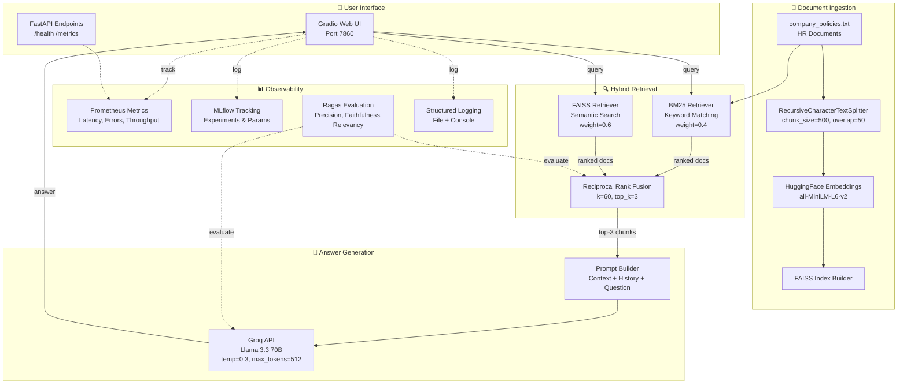

```mermaid
flowchart TB
    subgraph User["👤 User Interface"]
        GR[Gradio Web UI<br/>Port 7860]
        API[FastAPI Endpoints<br/>/health /metrics]
    end

    subgraph Ingestion["📄 Document Ingestion"]
        DOC[company_policies.txt<br/>HR Documents]
        SPLIT[RecursiveCharacterTextSplitter<br/>chunk_size=500, overlap=50]
        EMB_I[HuggingFace Embeddings<br/>all-MiniLM-L6-v2]
        FAISS_BUILD[FAISS Index Builder]
    end

    subgraph Retrieval["🔍 Hybrid Retrieval"]
        BM25[BM25 Retriever<br/>Keyword Matching<br/>weight=0.4]
        FAISS_R[FAISS Retriever<br/>Semantic Search<br/>weight=0.6]
        RRF[Reciprocal Rank Fusion<br/>k=60, top_k=3]
    end

    subgraph Generation["🤖 Answer Generation"]
        PROMPT[Prompt Builder<br/>Context + History + Question]
        GROQ[Groq API<br/>Llama 3.3 70B<br/>temp=0.3, max_tokens=512]
    end

    subgraph Monitoring["📊 Observability"]
        PROM[Prometheus Metrics<br/>Latency, Errors, Throughput]
        MLF[MLflow Tracking<br/>Experiments & Params]
        RAGAS[Ragas Evaluation<br/>Precision, Faithfulness,<br/>Relevancy]
        LOGS[Structured Logging<br/>File + Console]
    end

    DOC --> SPLIT --> EMB_I --> FAISS_BUILD
    DOC --> BM25

    GR -->|"query"| BM25
    GR -->|"query"| FAISS_R
    BM25 -->|"ranked docs"| RRF
    FAISS_R -->|"ranked docs"| RRF
    RRF -->|"top-3 chunks"| PROMPT
    PROMPT --> GROQ
    GROQ -->|"answer"| GR

    GR -.->|"track"| PROM
    GR -.->|"log"| MLF
    GR -.->|"log"| LOGS
    RAGAS -.->|"evaluate"| RRF
    RAGAS -.->|"evaluate"| GROQ
    API -.-> PROM
```
