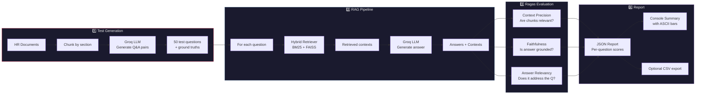

```mermaid
flowchart LR
    subgraph TestGen["1️⃣ Test Generation"]
        DOC[HR Documents] --> CHUNK[Chunk by section]
        CHUNK --> LLM_Q[Groq LLM<br/>Generate Q&A pairs]
        LLM_Q --> QA[50 test questions<br/>+ ground truths]
    end

    subgraph Pipeline["2️⃣ RAG Pipeline"]
        QA --> QUERY[For each question]
        QUERY --> RET[Hybrid Retriever<br/>BM25 + FAISS]
        RET --> CTX[Retrieved contexts]
        CTX --> GEN[Groq LLM<br/>Generate answer]
        GEN --> ANS[Answers + Contexts]
    end

    subgraph Eval["3️⃣ Ragas Evaluation"]
        ANS --> CP[Context Precision<br/>Are chunks relevant?]
        ANS --> FF[Faithfulness<br/>Is answer grounded?]
        ANS --> AR[Answer Relevancy<br/>Does it address the Q?]
    end

    subgraph Report["4️⃣ Report"]
        CP --> JSON[JSON Report<br/>Per-question scores]
        FF --> JSON
        AR --> JSON
        JSON --> CONSOLE[Console Summary<br/>with ASCII bars]
        JSON --> CSV[Optional CSV export]
    end

    style TestGen fill:#1a1a2e,stroke:#e94560,color:#eee
    style Pipeline fill:#1a1a2e,stroke:#0f3460,color:#eee
    style Eval fill:#1a1a2e,stroke:#16213e,color:#eee
    style Report fill:#1a1a2e,stroke:#533483,color:#eee
```
