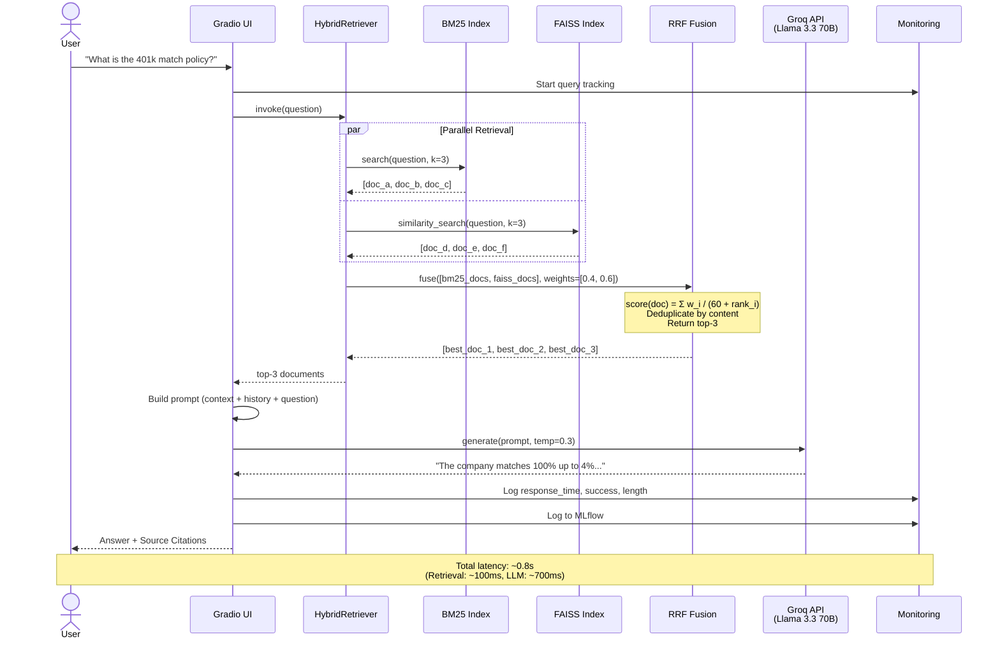

```mermaid
sequenceDiagram
    actor User
    participant UI as Gradio UI
    participant HR as HybridRetriever
    participant BM25 as BM25 Index
    participant FAISS as FAISS Index
    participant RRF as RRF Fusion
    participant LLM as Groq API<br/>(Llama 3.3 70B)
    participant MON as Monitoring

    User->>UI: "What is the 401k match policy?"
    UI->>MON: Start query tracking
    
    UI->>HR: invoke(question)
    
    par Parallel Retrieval
        HR->>BM25: search(question, k=3)
        BM25-->>HR: [doc_a, doc_b, doc_c]
    and
        HR->>FAISS: similarity_search(question, k=3)
        FAISS-->>HR: [doc_d, doc_e, doc_f]
    end
    
    HR->>RRF: fuse([bm25_docs, faiss_docs], weights=[0.4, 0.6])
    Note over RRF: score(doc) = Σ w_i / (60 + rank_i)<br/>Deduplicate by content<br/>Return top-3
    RRF-->>HR: [best_doc_1, best_doc_2, best_doc_3]
    HR-->>UI: top-3 documents
    
    UI->>UI: Build prompt (context + history + question)
    UI->>LLM: generate(prompt, temp=0.3)
    LLM-->>UI: "The company matches 100% up to 4%..."
    
    UI->>MON: Log response_time, success, length
    UI->>MON: Log to MLflow
    UI-->>User: Answer + Source Citations
    
    Note over User,MON: Total latency: ~0.8s<br/>(Retrieval: ~100ms, LLM: ~700ms)
```
