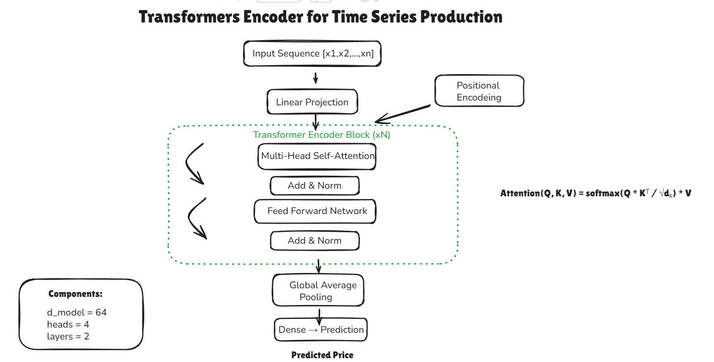
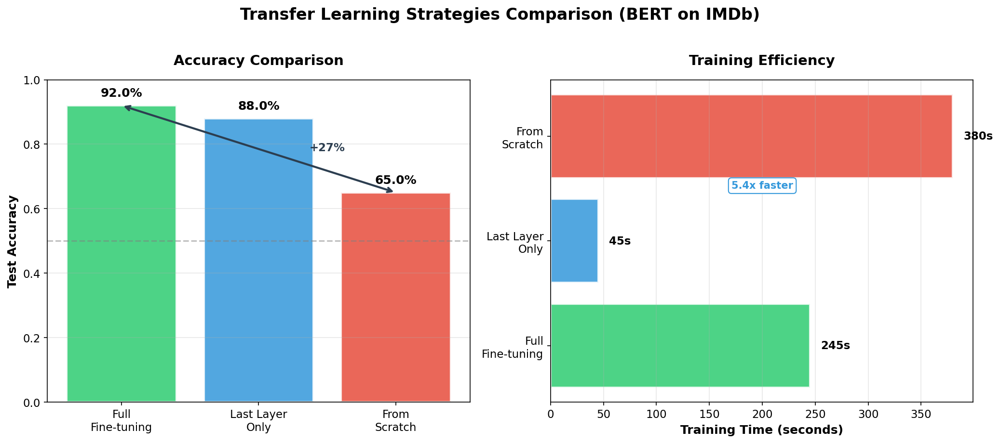

# 🤖 Advanced AI Engineering Portfolio

[](https://python.org)
[](https://pytorch.org)
[](https://huggingface.co/transformers)
[](https://langchain.com)
[](https://github.com/features/actions)

> Production-ready AI/ML projects demonstrating expertise in **LLMs**, **RAG Systems**, **RLHF**, **Fine-tuning**, and **Deep Learning**

---

## 🎯 Portfolio Overview

This repository showcases **9 production-ready projects** covering the full spectrum of modern AI engineering:

| Category | Projects | Key Technologies |
|----------|----------|------------------|
| **LLM Fine-tuning** | Legal Text Generator | LoRA, PEFT, GPT-2, Gradio |
| **RAG Systems** | GRADIO_RAG, RAG-OPENAI | Groq, OpenAI, LangChain, FAISS |
| **RLHF & Alignment** | KL Guard RLHF, Reward Model | PPO, TRL, PyTorch |
| **Deep Learning** | Transformers, Animal Classifier | Custom Attention, CNN, VGG16 |
| **NLP** | Transfer Learning Text | BERT, Sentiment Analysis |

---

## 🚀 Featured Projects

---

### 📜 1. Legal & Business Text Generator
> **Fine-tuned LLM for professional document generation using LoRA**

[](https://huggingface.co/spaces/KradyelSebi/legal-text-generator)

| Aspect | Details |
|--------|---------|
| **Location** | [`legal-text-generator/`](./legal-text-generator) |
| **Tech Stack** | GPT-2 Medium, LoRA/PEFT, Gradio, HuggingFace Spaces |
| **Live Demo** | [huggingface.co/spaces/KradyelSebi/legal-text-generator](https://huggingface.co/spaces/KradyelSebi/legal-text-generator) |

**Highlights:**
- ✅ Parameter-efficient fine-tuning (only **0.4% params** trained)
- ✅ 8 document types: contracts, NDAs, policies, emails, meeting minutes
- ✅ **Production deployed** on HuggingFace Spaces
- ✅ Custom training with 200+ legal document examples

**Skills Demonstrated:** `LLM Fine-tuning` `LoRA/PEFT` `Model Deployment` `Gradio`

---

### 🌐 2. GRADIO RAG System (Groq-Powered)
> **Interactive RAG chatbot with Groq LLM and Gradio interface**

[](https://advanced-ai-engineering-portfolio.onrender.com/)

| Aspect | Details |
|--------|---------|
| **Location** | [`GRADIO_RAG/`](./GRADIO_RAG) |
| **Tech Stack** | Groq API, LangChain, FAISS, Gradio, HuggingFace Embeddings |
| **Live Demo** | [advanced-ai-engineering-portfolio.onrender.com](https://advanced-ai-engineering-portfolio.onrender.com/) |

**Highlights:**
- ✅ Lightning-fast inference with **Groq LPU**
- ✅ Interactive web interface with Gradio
- ✅ Document upload and semantic search
- ✅ Pre-built FAISS index for instant loading

**Skills Demonstrated:** `RAG Architecture` `Groq API` `Vector Search` `Web Interface`

---

### 🔑 3. RAG System with OpenAI
> **Enterprise RAG implementation using OpenAI embeddings and GPT**

| Aspect | Details |
|--------|---------|
| **Location** | [`RAG-OPENAI/`](./RAG-OPENAI) |
| **Tech Stack** | OpenAI API, LangChain, FAISS, Python |

**Highlights:**
- ✅ OpenAI embeddings for superior semantic understanding
- ✅ GPT-powered response generation
- ✅ Configurable chunking strategies
- ✅ Production-ready error handling

**Skills Demonstrated:** `OpenAI API` `RAG Pipeline` `Embeddings` `LangChain`

---

### 🎯 4. RLHF with KL-Divergence Guard
> **Reinforcement Learning from Human Feedback with safety constraints**

| Aspect | Details |
|--------|---------|
| **Location** | [`KL_Guard_RLHF/`](./KL_Guard_RLHF) |
| **Tech Stack** | PyTorch, TRL, PPO, Transformers |

**Highlights:**
- ✅ Custom **KL-divergence guard** for distribution stability
- ✅ Prevents reward hacking and catastrophic forgetting
- ✅ Full PPO training loop implementation
- ✅ Configurable KL penalty coefficients

<details>
<summary>📊 RLHF Pipeline Architecture</summary>


</details>

**Skills Demonstrated:** `RLHF` `PPO Algorithm` `Model Alignment` `PyTorch`

---

### ⭐ 5. Reward Model Training
> **Training reward models for human preference learning**

| Aspect | Details |
|--------|---------|
| **Location** | [`Reward-Model-Training/`](./Reward-Model-Training) |
| **Tech Stack** | PyTorch, Transformers, Custom Training Loop |

**Highlights:**
- ✅ Pairwise preference learning
- ✅ Bradley-Terry model implementation
- ✅ Integration with RLHF pipeline
- ✅ Custom loss functions for ranking

**Skills Demonstrated:** `Reward Modeling` `Preference Learning` `Custom Training`

---

### 📈 6. Custom Transformer Stock Predictor
> **Ground-up Transformer implementation for financial time-series forecasting**

| Aspect | Details |
|--------|---------|
| **Location** | [`Transformers/`](./Transformers) |
| **Tech Stack** | PyTorch, NumPy, Custom Architecture |

**Highlights:**
- ✅ **Multi-Head Attention from scratch**
- ✅ Positional Encoding implementation
- ✅ Time-series prediction for stock prices
- ✅ Complete encoder architecture

<details>
<summary>📊 Transformer Encoder Architecture</summary>



</details>

**Skills Demonstrated:** `Transformer Architecture` `Attention Mechanisms` `Time Series`

---

### 🐾 7. Universal Animal Classifier
> **Computer Vision with Transfer Learning using VGG16**

| Aspect | Details |
|--------|---------|
| **Location** | [`Animal-Classifier/`](./Animal-Classifier) |
| **Tech Stack** | PyTorch, VGG16, Transfer Learning |

**Highlights:**
- ✅ Pre-trained VGG16 backbone
- ✅ Custom classification head
- ✅ Data augmentation pipeline
- ✅ Multi-class classification

**Skills Demonstrated:** `Transfer Learning` `CNN` `Image Classification` `PyTorch`

---

### 📝 8. Text Sentiment Analysis (BERT)
> **BERT-based sentiment classification with transfer learning**

| Aspect | Details |
|--------|---------|
| **Location** | [`Transfer_Learning_Text/`](./Transfer_Learning_Text) |
| **Tech Stack** | BERT, HuggingFace Transformers, PyTorch |

**Highlights:**
- ✅ Fine-tuned BERT for sentiment analysis
- ✅ Custom tokenization pipeline
- ✅ Evaluation metrics and visualization
- ✅ Production-ready inference

<details>
<summary>📊 Transfer Learning Comparison</summary>



</details>

**Skills Demonstrated:** `NLP` `BERT Fine-tuning` `Text Classification`

---

## ⚙️ CI/CD Pipeline

This repository includes **GitHub Actions** for automated workflows:

| Workflow | Purpose |
|----------|---------|
| Deployment Health Check | Automated testing and validation |

Location: [`.github/workflows/`](./.github/workflows)

---

## 🛠️ Technical Skills

### Core Technologies
```
Python │ PyTorch │ TensorFlow │ HuggingFace Transformers │ LangChain │ OpenAI API │ Groq API
```

### AI/ML Expertise
```
├── 🔤 LLM & NLP
│   ├── Fine-tuning (LoRA, PEFT, Full)
│   ├── Prompt Engineering
│   ├── Text Generation & Classification
│   └── BERT, GPT-2, Llama
│
├── 📚 RAG Systems
│   ├── Vector Databases (FAISS, ChromaDB)
│   ├── Document Processing & Chunking
│   ├── Semantic Search & Retrieval
│   └── OpenAI & Groq Integration
│
├── 🎯 RLHF & Alignment
│   ├── Reward Modeling
│   ├── PPO Training
│   ├── KL-Divergence Control
│   └── Human Preference Learning
│
└── 🧠 Deep Learning
    ├── Transformers (from scratch)
    ├── CNNs & Transfer Learning
    ├── Attention Mechanisms
    └── Time Series Forecasting
```

### Deployment & Tools
```
Docker │ Git │ GitHub Actions │ HuggingFace Hub │ Gradio │ TensorBoard │ FAISS
```

---

## 📁 Repository Structure

```
Advanced-AI-Engineering-Portfolio/
│
├── 📜 legal-text-generator/           # LLM Fine-tuning with LoRA
│   ├── training/
│   ├── app/
│   └── screenshots/
│
├── 🌐 GRADIO_RAG/                     # RAG with Groq + Gradio
│   └── gradio_rag_app.py
│
├── 🔑 RAG-OPENAI/                     # RAG with OpenAI
│   └── rag_openai.py
│
├── 🎯 KL_Guard_RLHF/                  # RLHF with KL Guard
│   └── KL_Guard_RLHF.py
│
├── ⭐ Reward-Model-Training/          # Reward Model
│   └── reward_model_training.py
│
├── 📈 Transformers/                   # Custom Transformer
│   └── transformer_stock_prediction.py
│
├── 🐾 Animal-Classifier/              # CNN Transfer Learning
│   └── universal_classifier.py
│
├── 📝 Transfer_Learning_Text/         # BERT Fine-tuning
│   └── transfer_learning_text.py
│
├── 📂 docs/                           # Documentation & FAISS indices
│
├── 🖼️ images/                         # Architecture diagrams
│
├── ⚙️ .github/workflows/              # CI/CD Pipelines
│
└── 📄 README.md
```

---

## 🔗 Live Demos

| Project | Demo Link | Platform | Status |
|---------|-----------|----------|--------|
| **GRADIO RAG System** | [advanced-ai-engineering-portfolio.onrender.com](https://advanced-ai-engineering-portfolio.onrender.com/) | Render | ✅ Live |
| **Legal Text Generator** | [huggingface.co/spaces/KradyelSebi/legal-text-generator](https://huggingface.co/spaces/KradyelSebi/legal-text-generator) | HuggingFace | ✅ Live |

---

## 🎓 Certifications

| Certification | Issuer |
|---------------|--------|
| AI Engineering Professional Certificate | IBM |
| Data Science Professional Certificate | IBM |
| AWS DevOps | In Progress |

---

## 📊 Project Complexity Matrix

| Project | Difficulty | Lines of Code | Key Challenge |
|---------|------------|---------------|---------------|
| Legal Text Generator | ⭐⭐⭐⭐ | 3000+ | LoRA fine-tuning + deployment |
| GRADIO_RAG | ⭐⭐⭐ | 500+ | Groq integration + UI |
| KL_Guard_RLHF | ⭐⭐⭐⭐⭐ | 800+ | PPO + KL divergence control |
| Custom Transformer | ⭐⭐⭐⭐⭐ | 600+ | Attention from scratch |
| Reward Model | ⭐⭐⭐⭐ | 400+ | Preference learning |

---

## 📫 Contact

<p align="center">
  <a href="https://www.linkedin.com/in/sebastian-paul-manolache">
    
  </a>
  <a href="mailto:paulsebastiankradyel@gmail.com">
    
  </a>
  <a href="https://huggingface.co/KradyelSebi">
    
  </a>
</p>

---

<p align="center">
  <b>🚀 Open to AI/ML Engineering Opportunities</b><br>
  <i>Specializing in LLMs, RAG Systems, RLHF, and Production ML</i>
</p>

---

<p align="center">
  ⭐ <b>If you find this portfolio useful, please consider giving it a star!</b> ⭐
</p>
