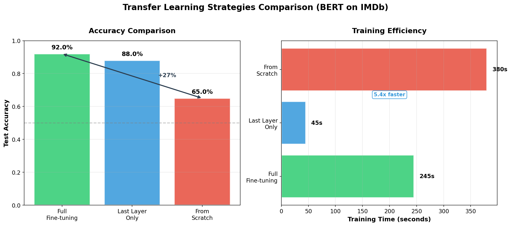
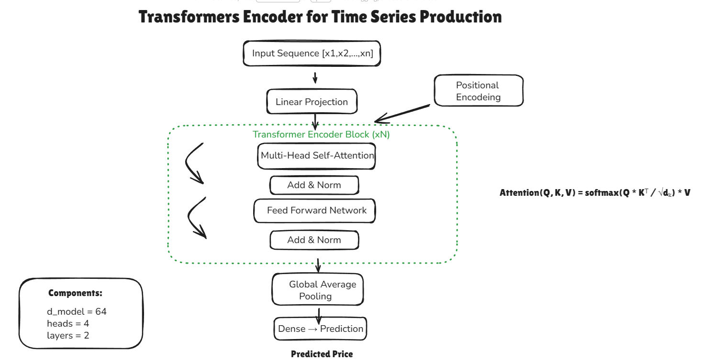

# 🤖 Advanced AI Engineering Portfolio

This repository contains production-ready Python scripts focusing on the latest advancements in Large Language Models (LLMs) and Neural Network architectures.

## 🚀 Key Projects

### 1. Enterprise HR RAG System
- **File:** `hr_rag_system_updated.py`
- **Tech Stack:** LangChain, FAISS, HuggingFace Embeddings, OpenAI/Flan-T5.
- **Description:** A complete Retrieval-Augmented Generation system that transforms static HR PDF/text policies into an interactive Q&A bot. Includes document chunking, vector indexing, and context-aware retrieval.

### 2. RLHF Alignment & Reward Modeling
- **Files:** `KL_Guard_RLHF.py`, `reward_model_training.py`
- **Tech Stack:** PyTorch, TRL (Transformer Reinforcement Learning), PPO.
- **Description:** Implementation of Reinforcement Learning from Human Feedback. It includes a custom KL-divergence guard to ensure the model stays aligned with the base distribution while optimizing for human preferences.

### 3. Custom Transformer Stock Predictor
- **File:** `transformer_stock_prediction.py`
- **Description:** A ground-up implementation of the Transformer architecture (Multi-Head Attention, Positional Encoding) applied to financial time-series forecasting.

### 4. Computer Vision & NLP Transfer Learning
- **Files:** `universal_classifier.py`, `transfer_learning_text.py`
- **Description:** Versatile scripts for image classification (VGG16) and text sentiment analysis (BERT) using advanced transfer learning techniques.

---

## 🐳 Docker Support

Each project includes Docker configuration for **reproducible environments** and **easy deployment**.

### Quick Start

```bash
# Clone the repository
git clone https://github.com/sebikradyel1-svg/Advanced-AI-Engineering-Portfolio.git
cd Advanced-AI-Engineering-Portfolio

# Build and run any project
cd RAG-HR-System
docker build -t hr-rag:latest .
docker run -it hr-rag:latest
```

### Available Docker Images

| Project | Build Command | Run Command |
|---------|---------------|-------------|
| **HR RAG System** | `docker build -t hr-rag .` | `docker run -it hr-rag` |
| **KL Guard RLHF** | `docker build -t kl-rlhf .` | `docker run -it kl-rlhf` |
| **Transformers** | `docker build -t transformer .` | `docker run -it transformer` |

### GPU Support (NVIDIA)

For projects requiring GPU acceleration:

```bash
# Install NVIDIA Container Toolkit first, then:
docker run --gpus all -it hr-rag:latest
```

### Docker Features

- ✅ **Multi-stage builds** - Optimized image sizes
- ✅ **Non-root user** - Security best practices
- ✅ **Health checks** - Container monitoring
- ✅ **Cached layers** - Fast rebuilds

---

## 🛠️ Skills Demonstrated

- LLM Orchestration & RAG
- Model Fine-tuning & RLHF
- Neural Network Architecture (Transformers)
- Production-level Python Coding
- **Docker & Containerization**
- **MLOps Best Practices**

---

## 📊 Architecture Diagrams






---

## 📫 Connect with me

- **LinkedIn:** [www.linkedin.com/in/paul-sebastian-kradyel](http://www.linkedin.com/in/paul-sebastian-kradyel)
- **Email:** [paulsebastiankradyel@gmail.com](mailto:paulsebastiankradyel@gmail.com)
