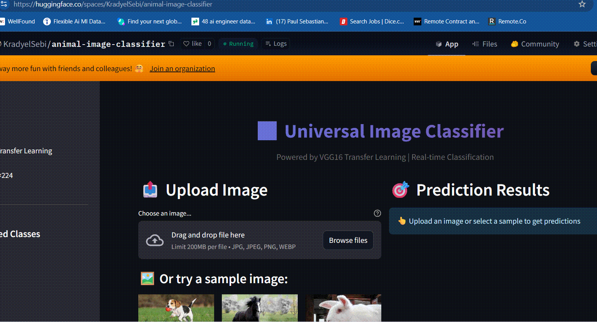
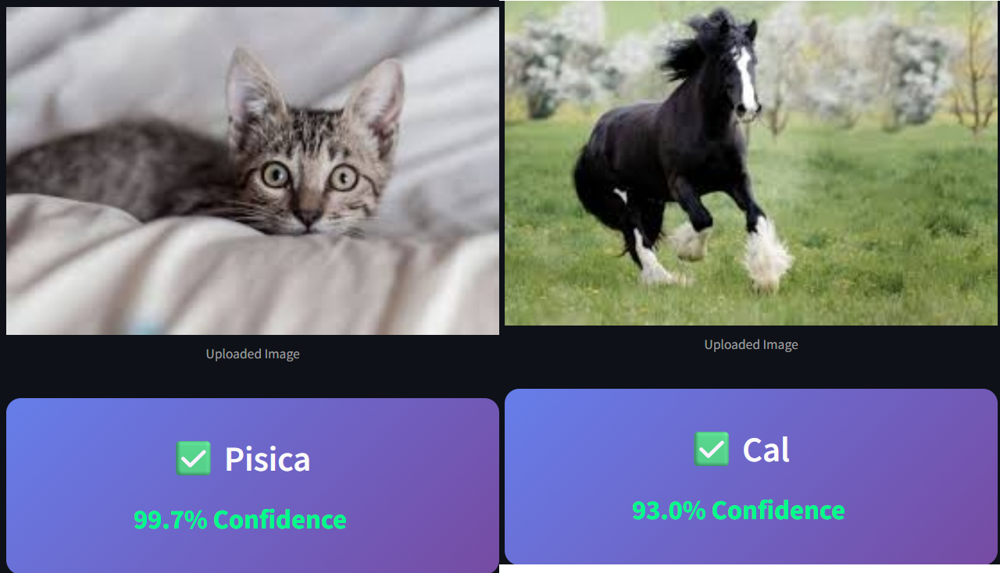
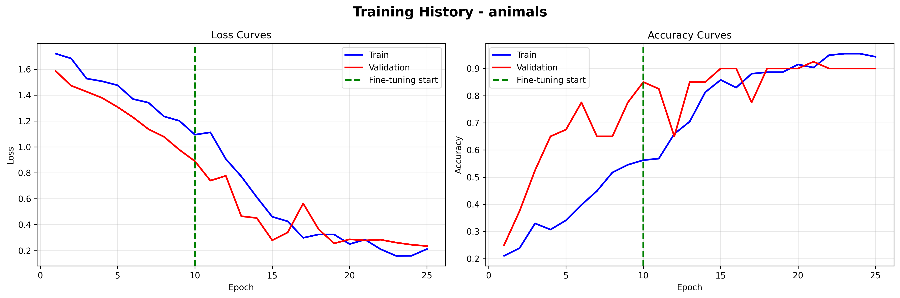

# 🖼️ Universal Image Classifier

[](https://python.org)
[](https://tensorflow.org)
[](https://streamlit.io)
[](https://docker.com)
[](LICENSE)

> **Production-ready image classification system using VGG16 Transfer Learning, deployable on Fly.io**


## 🚀 Live Demo

[](https://huggingface.co/spaces/KradyelSebi/animal-image-classifier)

**Try it live:** [https://huggingface.co/spaces/KradyelSebi/animal-image-classifier](https://huggingface.co/spaces/KradyelSebi/animal-image-classifier)

<p align="center">
  
  <br>
  <em>The model interface while classifying an image in real time.</em>
</p>

## 🏗️ Output
<p align="center">
  
</p>

## 📊 Model Performance
Analysis of the training curves shows stable convergence:

<p align="center">
  
</p>


## 🎯 Features

- **Universal Classification** - Adapts to any image dataset automatically
- **Transfer Learning** - Pre-trained VGG16 backbone for high accuracy
- **Real-time Inference** - Fast predictions with optimized model loading
- **Professional UI** - Beautiful Streamlit interface with confidence visualization
- **Docker Ready** - One-command deployment to cloud platforms
- **Sample Gallery** - Try the classifier with included example images

## 🏗️ Architecture

```
┌─────────────────────────────────────────────────────────────────┐
│                    Universal Image Classifier                    │
├─────────────────────────────────────────────────────────────────┤
│                                                                  │
│  ┌──────────────┐    ┌──────────────┐    ┌──────────────┐       │
│  │   Streamlit  │───▶│  TensorFlow  │───▶│    VGG16     │       │
│  │   Frontend   │    │   Backend    │    │   Backbone   │       │
│  └──────────────┘    └──────────────┘    └──────────────┘       │
│         │                   │                   │                │
│         ▼                   ▼                   ▼                │
│  ┌──────────────┐    ┌──────────────┐    ┌──────────────┐       │
│  │ Image Upload │    │ Preprocessing│    │  Dense Head  │       │
│  │  & Preview   │    │  & Scaling   │    │  (512→256→N) │       │
│  └──────────────┘    └──────────────┘    └──────────────┘       │
│                                                                  │
├─────────────────────────────────────────────────────────────────┤
│  Input: 224×224×3    │    Output: Top-3 predictions + confidence │
└─────────────────────────────────────────────────────────────────┘
```

## 📊 Model Performance

| Metric | Value |
|--------|-------|
| Base Model | VGG16 (ImageNet) |
| Input Size | 224 × 224 |
| Training Strategy | 2-Phase (Frozen → Fine-tuned) |
| Test Accuracy | ~95%+ (varies by dataset) |
| Inference Time | ~50-100ms (CPU) |

## 🚀 Quick Start

### Option 1: Local Development

```bash
# Clone repository
git clone https://github.com/yourusername/universal-image-classifier.git
cd universal-image-classifier

# Create virtual environment
python -m venv venv
source venv/bin/activate  # Linux/Mac
# venv\Scripts\activate   # Windows

# Install dependencies
pip install -r requirements.txt

# Run Streamlit app
streamlit run app/streamlit_app.py
```

### Option 2: Docker

```bash
# Build image
docker build -t image-classifier .

# Run container
docker run -p 8080:8080 image-classifier

# Access at http://localhost:8080
```

### Option 3: Deploy to Fly.io

```bash
# Install Fly CLI
curl -L https://fly.io/install.sh | sh

# Login & Deploy
fly auth login
fly launch
fly deploy

# Your app is live at https://your-app.fly.dev
```

## 📁 Project Structure

```
universal-image-classifier/
├── app/
│   └── streamlit_app.py      # Web interface
├── models/
│   ├── image_classifier_model.h5    # Trained model
│   └── image_classifier_config.json # Class mappings
├── sample_images/            # Example images for demo
├── docs/
│   ├── architecture.png      # System diagram
│   └── training_curves.png   # Training visualization
├── universal_classifier.py   # Training script
├── Dockerfile               # Container configuration
├── fly.toml                 # Fly.io deployment config
├── requirements.txt         # Python dependencies
└── README.md
```

## 🎓 Training Your Own Model

### 1. Prepare Dataset

Organize images in this structure:
```
data/your_project/
├── train/
│   ├── class_1/
│   ├── class_2/
│   └── class_n/
├── validation/
│   └── ...
└── test/
    └── ...
```

### 2. Train Model

```bash
python universal_classifier.py \
    --data_dir data/your_project \
    --project_name my_classifier \
    --initial_epochs 10 \
    --finetune_epochs 15
```

### 3. Copy Outputs

```bash
cp my_classifier_model.h5 models/image_classifier_model.h5
cp my_classifier_config.json models/image_classifier_config.json
```

## 🔧 Configuration

### Environment Variables

| Variable | Description | Default |
|----------|-------------|---------|
| `MODEL_PATH` | Path to .h5 model | `models/image_classifier_model.h5` |
| `CONFIG_PATH` | Path to config JSON | `models/image_classifier_config.json` |
| `TF_CPP_MIN_LOG_LEVEL` | TensorFlow log level | `2` |

### Fly.io Resources

Edit `fly.toml` to adjust resources:
```toml
[[vm]]
  cpu_kind = "shared"
  cpus = 1
  memory_mb = 512  # Increase for larger models
```

## 📈 Transfer Learning Process

```
Phase 1: Feature Extraction (Frozen VGG16)
├── Learning Rate: 0.001
├── Epochs: 10
├── VGG16 Layers: Frozen
└── Training: Only new dense layers

Phase 2: Fine-tuning (Unfrozen Block5)
├── Learning Rate: 0.0001
├── Epochs: 15
├── VGG16 Layers: Block5 unfrozen
└── Training: End-to-end refinement
```

## 🛠️ Tech Stack

| Component | Technology |
|-----------|------------|
| ML Framework | TensorFlow 2.15 |
| Base Model | VGG16 (ImageNet weights) |
| Web Framework | Streamlit 1.31 |
| Containerization | Docker |
| Deployment | Fly.io |
| Language | Python 3.10+ |

## 📝 License

MIT License - feel free to use for personal or commercial projects.

## 🤝 Contributing

Contributions welcome! Please read the contributing guidelines first.

## 📧 Contact

**Sebastian** - AI/ML Engineer  
[](https://linkedin.com/in/yourprofile)
[](https://github.com/yourusername)

---

<p align="center">
  Built with ❤️ using TensorFlow & Streamlit
</p>
