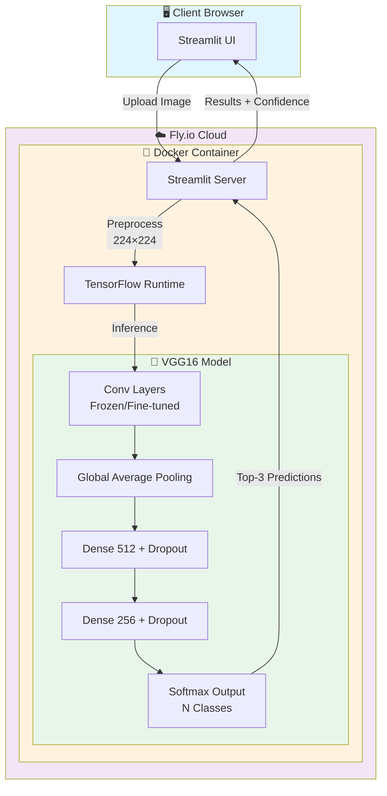
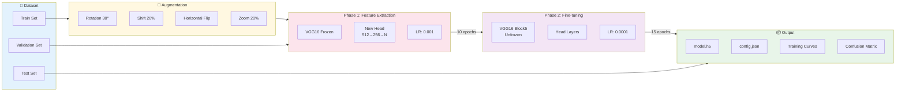
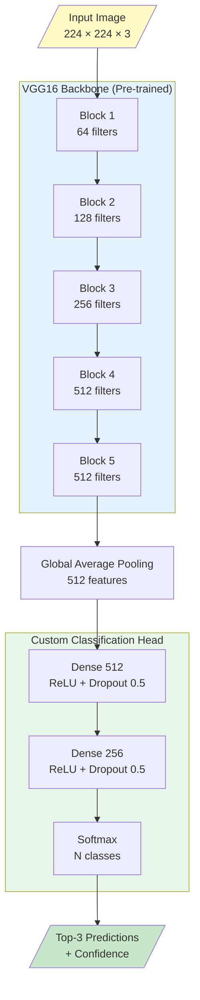
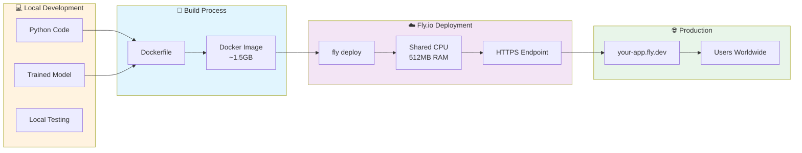
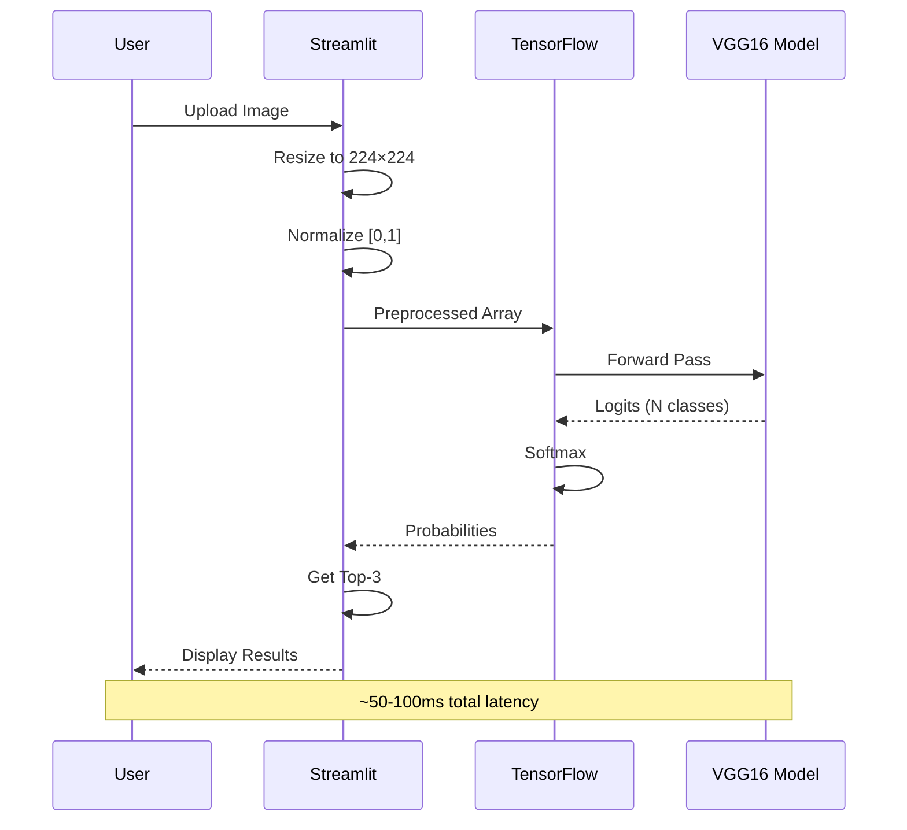

## Architecture Diagrams

### System Overview

```mermaid
flowchart TB
    subgraph Client["🖥️ Client Browser"]
        UI[Streamlit UI]
    end

    subgraph FlyIO["☁️ Fly.io Cloud"]
        subgraph Docker["🐳 Docker Container"]
            ST[Streamlit Server]
            TF[TensorFlow Runtime]
            
            subgraph Model["🧠 VGG16 Model"]
                CONV[Conv Layers<br/>Frozen/Fine-tuned]
                GAP[Global Average Pooling]
                FC1[Dense 512 + Dropout]
                FC2[Dense 256 + Dropout]
                OUT[Softmax Output<br/>N Classes]
            end
        end
    end

    UI -->|Upload Image| ST
    ST -->|Preprocess<br/>224×224| TF
    TF -->|Inference| CONV
    CONV --> GAP
    GAP --> FC1
    FC1 --> FC2
    FC2 --> OUT
    OUT -->|Top-3 Predictions| ST
    ST -->|Results + Confidence| UI

    style Client fill:#e1f5fe
    style FlyIO fill:#f3e5f5
    style Docker fill:#fff3e0
    style Model fill:#e8f5e9
```

### Training Pipeline

```mermaid
flowchart LR
    subgraph Data["📁 Dataset"]
        TRAIN[Train Set]
        VAL[Validation Set]
        TEST[Test Set]
    end

    subgraph Aug["🔄 Augmentation"]
        ROT[Rotation 30°]
        SHIFT[Shift 20%]
        FLIP[Horizontal Flip]
        ZOOM[Zoom 20%]
    end

    subgraph Phase1["Phase 1: Feature Extraction"]
        VGG1[VGG16 Frozen]
        HEAD1[New Head<br/>512→256→N]
        LR1[LR: 0.001]
    end

    subgraph Phase2["Phase 2: Fine-tuning"]
        VGG2[VGG16 Block5<br/>Unfrozen]
        HEAD2[Head Layers]
        LR2[LR: 0.0001]
    end

    subgraph Output["📦 Output"]
        MODEL[model.h5]
        CONFIG[config.json]
        CURVES[Training Curves]
        CM[Confusion Matrix]
    end

    TRAIN --> Aug
    Aug --> Phase1
    VAL --> Phase1
    Phase1 -->|10 epochs| Phase2
    Phase2 -->|15 epochs| Output
    TEST --> Output

    style Data fill:#e3f2fd
    style Aug fill:#fff8e1
    style Phase1 fill:#fce4ec
    style Phase2 fill:#f3e5f5
    style Output fill:#e8f5e9
```

### Model Architecture

```mermaid
flowchart TB
    INPUT[/"Input Image<br/>224 × 224 × 3"/]
    
    subgraph VGG["VGG16 Backbone (Pre-trained)"]
        B1[Block 1<br/>64 filters]
        B2[Block 2<br/>128 filters]
        B3[Block 3<br/>256 filters]
        B4[Block 4<br/>512 filters]
        B5[Block 5<br/>512 filters]
    end
    
    GAP[Global Average Pooling<br/>512 features]
    
    subgraph Head["Custom Classification Head"]
        D1[Dense 512<br/>ReLU + Dropout 0.5]
        D2[Dense 256<br/>ReLU + Dropout 0.5]
        SOFT[Softmax<br/>N classes]
    end
    
    OUTPUT[/"Top-3 Predictions<br/>+ Confidence"/]

    INPUT --> B1
    B1 --> B2
    B2 --> B3
    B3 --> B4
    B4 --> B5
    B5 --> GAP
    GAP --> D1
    D1 --> D2
    D2 --> SOFT
    SOFT --> OUTPUT

    style VGG fill:#e3f2fd
    style Head fill:#e8f5e9
    style INPUT fill:#fff9c4
    style OUTPUT fill:#c8e6c9
```

### Deployment Pipeline

```mermaid
flowchart LR
    subgraph Local["💻 Local Development"]
        CODE[Python Code]
        MODEL_L[Trained Model]
        TEST_L[Local Testing]
    end

    subgraph Build["🔨 Build Process"]
        DOCKER[Dockerfile]
        IMG[Docker Image<br/>~1.5GB]
    end

    subgraph Deploy["☁️ Fly.io Deployment"]
        FLY[fly deploy]
        VM[Shared CPU<br/>512MB RAM]
        HTTPS[HTTPS Endpoint]
    end

    subgraph Production["🌐 Production"]
        URL[your-app.fly.dev]
        USERS[Users Worldwide]
    end

    CODE --> DOCKER
    MODEL_L --> DOCKER
    DOCKER --> IMG
    IMG --> FLY
    FLY --> VM
    VM --> HTTPS
    HTTPS --> URL
    URL --> USERS

    style Local fill:#fff3e0
    style Build fill:#e1f5fe
    style Deploy fill:#f3e5f5
    style Production fill:#e8f5e9
```

### Request Flow

```mermaid
sequenceDiagram
    participant U as User
    participant S as Streamlit
    participant TF as TensorFlow
    participant M as VGG16 Model

    U->>S: Upload Image
    S->>S: Resize to 224×224
    S->>S: Normalize [0,1]
    S->>TF: Preprocessed Array
    TF->>M: Forward Pass
    M-->>TF: Logits (N classes)
    TF->>TF: Softmax
    TF-->>S: Probabilities
    S->>S: Get Top-3
    S-->>U: Display Results
    
    Note over U,M: ~50-100ms total latency
```
