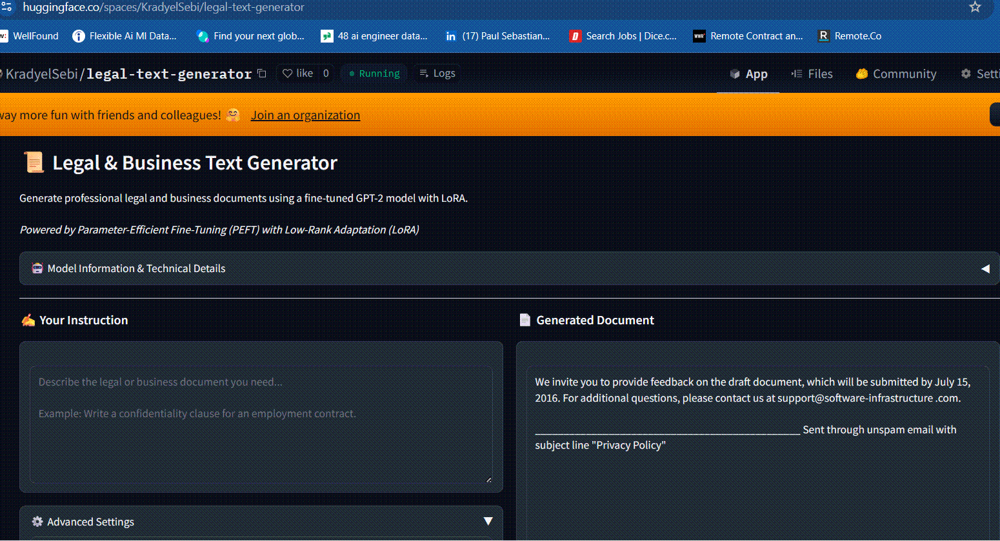
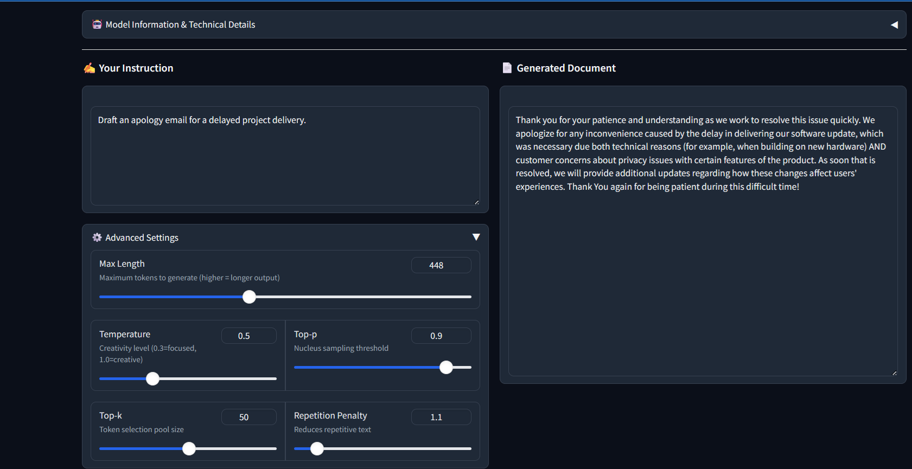
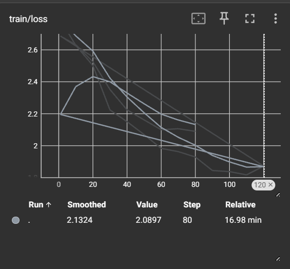

# 📜 Legal & Business Text Generator

> Fine-tuned GPT-2 model for generating professional legal and business documents using LoRA (Low-Rank Adaptation)

## [](https://huggingface.co/spaces/KradyelSebi/legal-text-generator)
### [](https://python.org)
### [](https://pytorch.org)
### [](LICENSE)



## 🎯 Project Overview

This project demonstrates **Parameter-Efficient Fine-Tuning (PEFT)** using **LoRA** to create a domain-specific language model for generating legal and business documents. The model was fine-tuned on GPT-2 Medium and deployed as an interactive web application.

### Key Highlights

- **99.6% Parameter Reduction**: Only 0.4% of parameters trained using LoRA
- **8 Document Types**: Contracts, NDAs, policies, emails, and more
- **Production Deployed**: Live demo on HuggingFace Spaces
- **Cost Effective**: Trained on consumer GPU (RTX 3060)

## 🚀 Live Demo

**Try it now:** [https://huggingface.co/spaces/KradyelSebi/legal-text-generator](https://huggingface.co/spaces/KradyelSebi/legal-text-generator)



## 🛠️ Technical Stack

| Component | Technology |
|-----------|------------|
| Base Model | GPT-2 Medium (355M params) |
| Fine-tuning | LoRA via PEFT library |
| Framework | PyTorch, Transformers |
| Web Interface | Gradio |
| Deployment | HuggingFace Spaces |

## 📊 Model Architecture

```
┌─────────────────────────────────────────────────┐
│                  GPT-2 Medium                    │
│               (355M parameters)                  │
│                   FROZEN ❄️                      │
├─────────────────────────────────────────────────┤
│              LoRA Adapters                       │
│           (1.5M parameters)                      │
│              TRAINABLE 🔥                        │
│                                                  │
│  ┌─────────┐    ┌─────────┐    ┌─────────┐     │
│  │ c_attn  │    │ c_proj  │    │  c_fc   │     │
│  │  LoRA   │    │  LoRA   │    │  LoRA   │     │
│  └─────────┘    └─────────┘    └─────────┘     │
└─────────────────────────────────────────────────┘
```

### LoRA Configuration

```python
LoraConfig(
    r=16,                              # Rank
    lora_alpha=32,                     # Scaling factor
    target_modules=["c_attn", "c_proj"],
    lora_dropout=0.05,
    bias="none",
    task_type="CAUSAL_LM"
)
```

### Why LoRA?

| Metric | Full Fine-tuning | LoRA |
|--------|------------------|------|
| Trainable Parameters | 355M (100%) | 1.5M (0.4%) |
| GPU Memory Required | 12GB+ | 4-6GB |
| Training Time | 6+ hours | ~1 hour |
| Model Size | 1.4GB | 35MB adapters |

## 📈 Training Results



| Metric | Value |
|--------|-------|
| Training Epochs | 5 |
| Final Training Loss | ~0.9 |
| Learning Rate | 2e-4 |
| Batch Size | 2 (effective: 8) |
| Training Time | ~45 minutes |

## 📋 Supported Document Types

| Category | Examples |
|----------|----------|
| **Contracts** | Employment agreements, confidentiality clauses, termination clauses |
| **NDAs** | Mutual NDAs, unilateral NDAs, IP protection clauses |
| **Policies** | Privacy policies, data retention, cookie policies |
| **Correspondence** | Professional emails, meeting follow-ups, proposals |
| **Legal Documents** | Terms of Service, limitation of liability, disclaimers |
| **Business Documents** | Meeting minutes, executive summaries, recommendations |

## 🖥️ Local Development

### Prerequisites

- Python 3.10+
- CUDA-capable GPU (optional, but recommended)
- 8GB+ RAM

### Installation

```bash
# Clone the repository
git clone https://github.com/KradyelSebi/legal-text-generator.git
cd legal-text-generator

# Create virtual environment
python -m venv venv
source venv/bin/activate  # Linux/Mac
# or
venv\Scripts\activate     # Windows

# Install dependencies
pip install -r requirements.txt
```

### Training Your Own Model

```bash
# Quick test (30 minutes)
python training/english_legal_llm_finetuning.py --preset quick

# Quality training (2-3 hours) - RECOMMENDED
python training/english_legal_llm_finetuning.py --preset quality

# Extended training (4-5 hours)
python training/english_legal_llm_finetuning.py --preset extended

# Custom configuration
python training/english_legal_llm_finetuning.py \
    --epochs 10 \
    --lora_r 32 \
    --learning_rate 1e-4
```

### Running the Web App

```bash
# Run locally
python app/app.py

# Access at http://localhost:7860
```

## 📁 Project Structure

```
legal-text-generator/
├── training/
│   ├── english_legal_llm_finetuning.py    # Training script
│   └── english_legal_llm_finetuning_LONG.py # Extended training
├── app/
│   └── app.py                              # Gradio web interface
├── model/                                   # LoRA adapters (after training)
│   ├── adapter_config.json
│   ├── adapter_model.safetensors
│   └── tokenizer files...
├── screenshots/
│   ├── demo.gif
│   ├── app_screenshot.png
│   └── training_loss.png
├── requirements.txt
└── README.md
```

## 🔧 Requirements

```
torch>=2.0.0
transformers>=4.35.0
peft>=0.6.0
accelerate>=0.24.0
gradio>=6.0.0
datasets>=2.14.0
```

## 📝 Example Outputs

### Input
```
Write a confidentiality clause for a software development contract.
```

### Output
```
CONFIDENTIALITY AND PROPRIETARY INFORMATION

1. Definition of Confidential Information
"Confidential Information" means all non-public information relating to 
the Company's business, including: trade secrets, source code, algorithms,
technical specifications, customer data, and business strategies.

2. Non-Disclosure Obligations
The Contractor agrees to: (a) hold all Confidential Information in strict
confidence; (b) not disclose to any third party without prior written 
consent; (c) use Confidential Information solely for the contracted work...
```

## 🎓 What I Learned

- **LoRA Fine-tuning**: Implementing parameter-efficient training
- **PEFT Library**: Using HuggingFace's PEFT for adapter-based fine-tuning
- **Model Deployment**: Deploying ML models to HuggingFace Spaces
- **Gradio**: Building interactive ML demos
- **Training Optimization**: Mixed precision, gradient accumulation

## 🔗 Related Projects

- [HR RAG Assistant](https://github.com/KradyelSebi/hr-rag-assistant) - RAG system for HR document Q&A
- [RLHF Reward Model](https://github.com/KradyelSebi/rlhf-reward-model) - Reward model training with PPO

## 📄 License

This project is licensed under the MIT License - see the [LICENSE](LICENSE) file for details.

## ⚠️ Disclaimer

This tool generates text for educational and demonstration purposes only. Generated content should be reviewed by qualified legal professionals before use in actual legal documents or business agreements.

---

## 👤 Author

**Sebastian Manolache**

AI Engineer & ML Specialist

[](https://www.linkedin.com/in/sebastian-paul-manolache)
[](https://github.com/KradyelSebi)
[](https://huggingface.co/KradyelSebi)

---

*Built as part of my AI Engineering Portfolio demonstrating LLM fine-tuning and deployment skills.*
